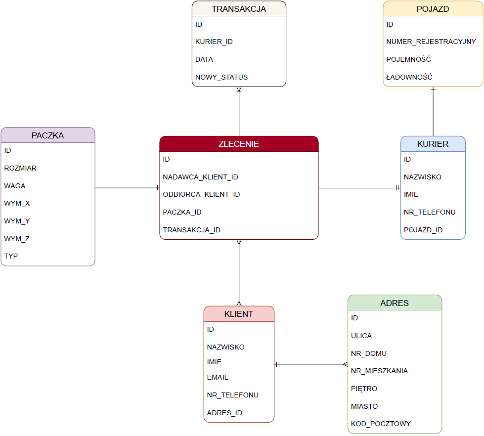

## Baza danych firmy kurierskiej

# Opis projektu
Celem projektu jest zaprojektowanie i stworzenie webowej aplikacji bazodanowej do wykorzystania przez firmę kurierską w celu uporządkowania . 

Baza danych powstaje przy użyciu programu SQL Developer i języka PL/SQL.

Diagram ERD przedstawiający strukturę bazy danych znajduje się poniżej.

Wykonawcy projektu:
 * Michał Maćkowiak
 * Michał Dołharz

 Prowadzący projekt:
 * dr hab. inż. Grzegorz Mzyk, prof. PWr