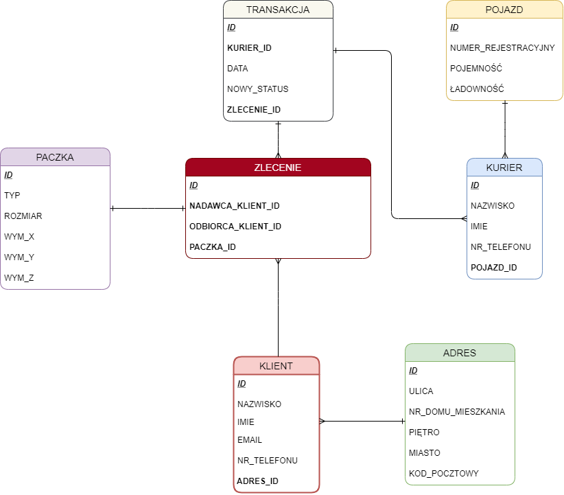

# Baza danych firmy kurierskiej

## Opis projektu
Celem projektu jest zaprojektowanie i stworzenie webowej aplikacji bazodanowej do wykorzystania przez firmę kurierską w celu uporządkowania. 

Baza danych powstaje przy użyciu programu SQL Developer i języka PL/SQL. Pliki w tym repozytorium nie są całą bazą danych, a jedynie zbiorem implementacji poszczególnych tabel i procedur. Do poprawnego funkcjonowania niezbędne jest ustawienie automatycznego indeksowania, a więc w oknie edycji **każdej tabeli** w zakładce Identity Column należy ustawić *Type: Column Sequence*. Odpowiednie pliki *TRIGGER* i *SEQUENCE* zostaną wygenerowane autmatycznie.

Diagram ERD przedstawiający strukturę bazy danych znajduje się poniżej.

Wykonawcy projektu:
 * Michał Maćkowiak
 * Michał Dołharz

 Prowadzący projekt:
 * dr hab. inż. Grzegorz Mzyk, prof. PWr
